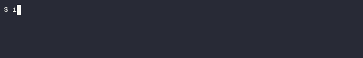
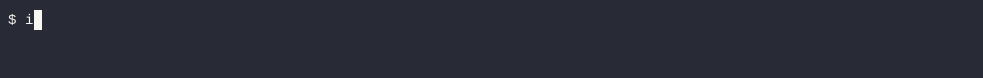
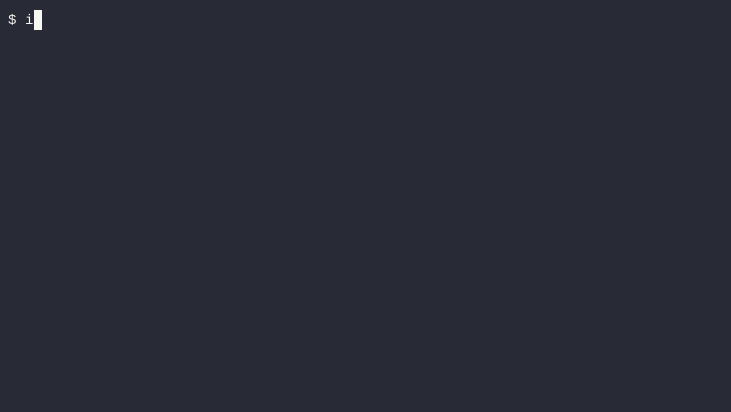

[](https://github.com/greycubesgav/integrity/actions/workflows/package.yml)
[](https://goreportcard.com/report/github.com/greycubesgav/integrity)
[](https://raw.githack.com/wiki/greycubesgav/integrity/coverage.html)
[](https://www.gnu.org/licenses/old-licenses/lgpl-2.1.html)

# Integrity
Cross platform command line tool for storing, displaying and checking a file's checksum.

Check your files have not become corrupted over time.



## Features

* Supports Linux, FreeBSD and OSX
* Checksum data is stored in the file's extended attributes so moves with the file.
* Multiple checksum algorithms available (defaults to sha1)

| MD Functions | SHA Functions | SHA3 + SHA512 Functions  | Blake Functions | File Type Specific Functions |
|--------------|---------------|--------------------------|-----------------|------------------------------|
| md5          | **[sha1]**    | sha3 224                 | blake2s 256     | phash (images)               |
| md5sha1      | sha224        | sha3 256                 | blake2b 256     | ohash (videos)               |
|              | sha256        | sha3 384                 | blake2b 384     |
|              | sha384        | sha3 512                 | blake2b 512     |
|              | sha512        | sha512 224               |                 |
|              |               | sha512 256               |                 |

## Simple Usage examples

### Add checksum data to a file

```bash
$> integrity -a file.dat
file.dat : sha1 : added
```


### Display checksum data stored with file

```bash
integrity -l file.dat
```


### Validate the file still matches the stored checksum

```bash
integrity -c file.dat
```


## Custom Checksum Usage Examples

### Add a phash checksum verbosly to an image using the phash binary

```bash
integrity.phash -v -a image.jpg
```


### Add a blake2b_256 checksum verbosly to a file
```bash
integrity --digest blake2b_256 -v -a file.dat
```



Alternatively the Environment variable INTEGRITY_DIGEST may be used
```bash
export INTEGRITY_DIGEST="sha256"; integrity -a file.dat
```

### List all potential checksums stored with a file

```bash
integrity -l -x file.dat
```




